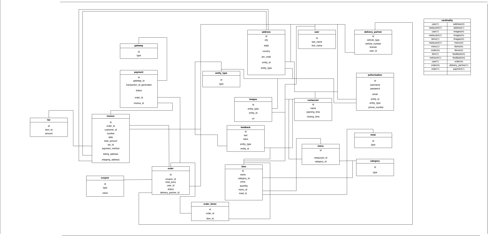
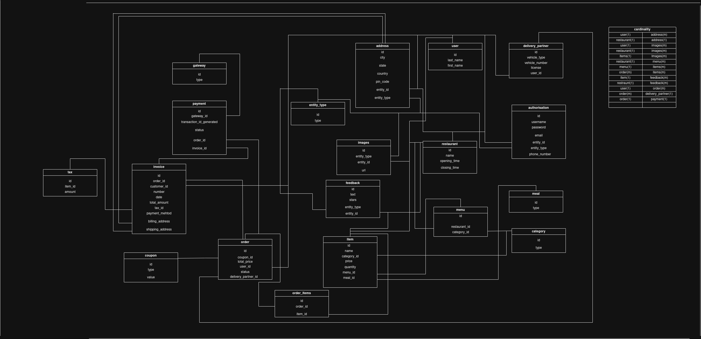

# java_topics

## Day-1
Java : Concurrency , Multithreading	 
Question	 
Thread Pool	Producer-Consumer Problem
Executor Service	 
Semaphores	 	 	 
Blocking Queue	 	 	 
Synchronization	 	 	 
Priority Queue	

## Day-2
 
Java : Java 8, 11, Collections	 	 	 
Question	 
Streams Api	Streams api operations
Use of Optionals	Paraller Stream
Lambda Exprressions, Functional Interfaces	Optionals
Default and static methods on intterfaces	 
 	 
Discussion on How to choose collections ?	Collections Operations

## Day-5
Topics	Database : Relational DB	 	 	 	 	 
S.no	Question	 	Reference
 	Mysql and Nosql	Database designing	 
 	Normalisation	 	 	
 	Triggers	 	 	
 	Joins, Group by, order by	 	 	 	 
 	ACID Properties	 	 	 	 
 	Keys	 	 	 	 
 	Indexing				

## Saturday
- Java : Ticket Booking System (Concurrent)

- ER Diagram Food Delivery Application

## 3 Feb
DB design review and
Non-SQL DB	feedback implementations
Mongo	 
 
 
What is rest api ?	Create Apis endpoints
Why need apis?	in excel for the same
RestApis guidelines	db design problem
 	 
Postman	Create api collection